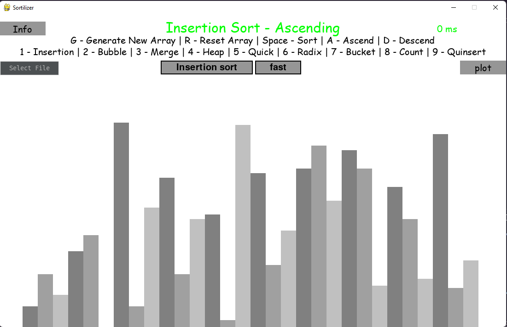

# Sortilizer - Sorting Algorithm Visualizer

Sortilizer is a Python-based sorting algorithm visualizer built using the Pygame library. It provides an interactive and real-time visualization of various sorting algorithms, allowing you to observe how different algorithms work and compare their performances.

<p align="center">
  
</p>

## Features

- Visualizes popular sorting algorithms, including:
  - Insertion Sort
  - Bubble Sort
  - Merge Sort
  - Heap Sort
  - Quick Sort
  - Radix Sort
  - Bucket Sort
  - Count Sort
  - Quinsert Sort
  - Range Query (Note: This is not a typical sorting algorithm but a custom range query visualization)
- Interactive user interface with control options for sorting algorithm selection, sorting direction (ascending/descending), and frame rate control.
- Generate random or input-defined lists of integers for visualization.
- Real-time timer to display the time taken for sorting.

## Getting Started

### Prerequisites

Make sure you have Python 3.x installed on your system.

### Installation

1. Clone the repository:
   ```sh
   git clone https://github.com/hanzala-bhutto/sortilizer.git
2. Move into root directory of sortilizer
   ```sh
   cd sortilizer
3. Install the dependencies
   ```sh 
   pip install -r requirements.txt
4. run using main.py
   ```sh
   python main.py
